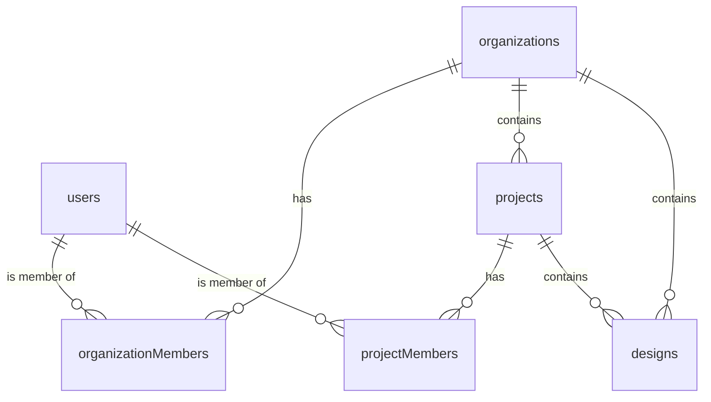

# Database Schema Overview

The AluGamma project uses **Convex** as its database. The schema is defined in `convex/schema.ts` and follows a relational structure optimized for multi-tenant organizations and projects.

## 1. Relational Map
The hierarchy follows a strict ownership chain:
**Users** → **Organizations** → **Projects** → **Designs** (and soon **NC Programs**)

## 2. Table Descriptions

### `users` (via Auth)
Stores basic user information like email, name, and image. Managed by `@convex-dev/auth`.

### `organizations`
The top-level tenant. 
- **Fields**: `name`, `slug`, `createdBy`, `createdAt`, `updatedAt`.
- **Indexing**: Optimized for slug-based lookups.

### `organizationMembers`
Maps users to organizations with specific roles.
- **Roles**: `owner`, `admin`, `member`.
- **Primary Use**: Controlling administrative access and project creation within a company.

### `projects`
Workspaces within an organization.
- **Fields**: `organizationId`, `name`, `slug`, `description`, `defaults`, `createdBy`.
- **Importance**: Every design and NC program must belong to a single project.

### `designs` (Current Implementation)
Stores sheet metal design data (`.dxf` related).
- **Fields**: `organizationId`, `projectId`, `name`, `exportName`, `model`, `createdBy`, `updatedBy`.
- **`model`**: A complex JSON object (validated by `sheetModelValidator`) containing all the dimensions, flanges, and configurations for the sheet metal part.

## 3. Key Observations for NC Programs
When we implement the **NC Programs** table, it should follow the `designs` pattern:
1. It must reference both `organizationId` and `projectId`.
2. It should store a `job_id` (from the CNC backend) or the raw NC text.
3. It should include metadata like `algorithm` used, `Scenario`, and `estimated_time`.
